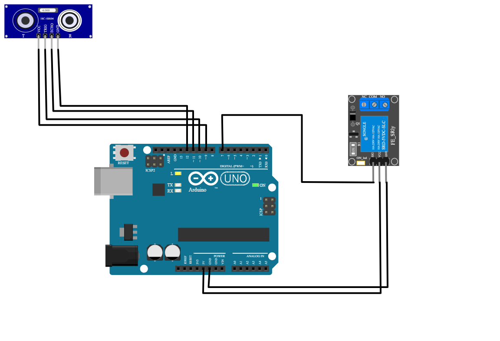
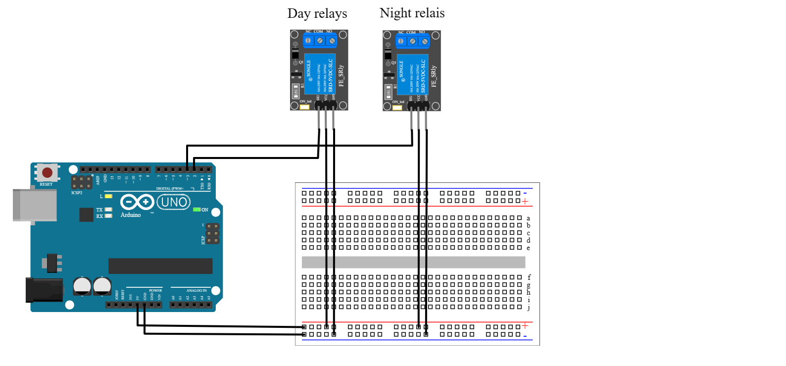

# Presepe with Arduino

Nativity scene (_crib_ or in italian _presepe_) controlled by two arduinos.

The _presepe_ shuts off after an ultrasonic sensor doesn't detect people in front of it for a certain amount of time. This is done via a relays that cuts power to every other thing.

An other board tries to emulate a day-night light cicle: turning off lights in the houses during the day and turning on the one that should represent the sun or turning off the "shops" during the night. This is done through two more switches and a timer.

Both the codes can be found in the repo and can be easly adapted to different situations

